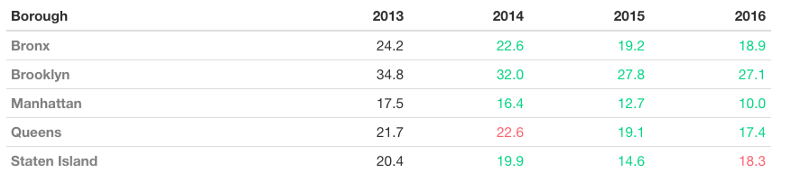
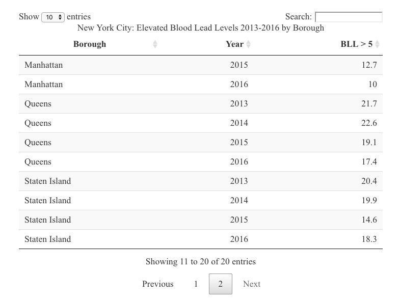

Due date: Monday, November 23rd

*To submit, please email your html file to Lawrence (lytello@berkeley.edu).*

```{r, include=F}
library(tidyverse)
library(formattable)
library(DT)
```

```{r, include=F}
bll_nyc <- read_csv("data/bll_nyc_per_1000.csv")
```

### Question 1

For this question we will use the same [NYC data on elevated blood lead levels (BLL)](https://data.cityofnewyork.us/Health/Children-Under-6-yrs-with-Elevated-Blood-Lead-Leve/tnry-kwh5) from the previous problem set.

Create a formattable table (example below) that shows the elevated blood lead levels per 1000 tested across 2013-2016. If the BLL increases from the previous year, turn the text red. If the BLL decreases from the previous year, turn the text green. To accomplish this color changing, you may want to create three indicator variables that check the value between years (e.g. use if_else). If you've have used conditional formatting on excel/google sheets, the concept is the same, but with R. 

Note: If you are using if_else (hint hint) and checking by the year, you will likely need to use the [left quote, actute, backtip](https://www.computerhope.com/jargon/b/backquot.htm#:~:text=Alternatively%20known%20as%20acute%2C%20backtick,keyboard%20key%20as%20the%20tilde.), to reference the variable. 

We have also provided you a function that you can use within your formattable table to reference this indicator variable to help reduce the code. However, you do not have to use this, and feel free to change the hex colors. 

```{r, include=F, eval=F}

```

```{r}
# in the event that plotly was run below, detach plotly
# the option 'style' conflicts when both libraries are loaded
#detach("package:plotly", unload=TRUE)

# pivot from long to wide
bll_nyc_wide <- bll_nyc %>%
  pivot_wider(names_from = time_period, values_from = bll_5plus_1k) %>%
  # creating an indicator variable if value increased from previos year
  mutate(x_14 = if_else(`2014` > `2013`, 1, 0),
         x_15 = if_else(`2015` > `2014`, 1, 0),
         x_16 = if_else(`2016` > `2015`, 1, 0))

# function that returns red if indicator == 1, green otherwise
up_down = function(indicator) {
  return(ifelse( indicator == 1, "#fd626e", "#03d584"))
}

formattable(bll_nyc_wide,
            align = c("l", rep("r", NROW(bll_nyc_wide) - 1)), # make first column left aligned
                      list(x_14 = FALSE, # hide indicator columns
                           x_15 = FALSE,
                           x_16 = FALSE,
                           'Borough' = formatter("span", style = ~ style(color = "grey", font.weight = "bold")), 
                           '2014' = formatter("span", style = ~ style(color = up_down(x_14))),
                           '2015' = formatter("span", style = ~ style(color = up_down(x_15))),
                           '2016' = formatter("span", style = ~ style(color = up_down(x_16)))))

```
\newpage

### Question 2

Using the same New York City Blood Elevated Lead Levels data from Question 1, create a table with the DT library. Below is an example of the table to replicate. Look up the callback argument to make sure the table, when loaded, starts on the second page.

```{r, include=F, eval=F}

```

```{r}
datatable(bll_nyc, 
          rownames = FALSE,
          colnames = c('Borough', 'Year', 'BLL > 5'),
          caption = "New York City: Elevated Blood Lead Levels 2013-2016 by Borough",
          callback = JS('table.page("next").draw(false);')) # start on second page
```

\newpage

### Question 3

For this question, we will use suicide rates data that comes from [the CDC](https://www.cdc.gov/nchs/pressroom/sosmap/suicide-mortality/suicide.htm). 

Replicate the graph below. 

```{r, include=F, eval=F}
knitr::include_graphics('data/question_3_graph.png')
```

```{r, include=F}
# issues with formattable and plotly together since the "style" option overlap
# https://stackoverflow.com/questions/39319427/using-formattable-and-plotly-simultaneously
# detach("package:formattable", unload=TRUE)
library(plotly)

df_suicide <- read_csv("data/Suicide Mortality by State.csv")
```


```{r}


df_suicide <- read_csv("data/Suicide Mortality by State.csv") %>%
  filter(STATE %in% c("CA", "NY", "WY", "MI", "HI", "FL", "AZ"))
 
plot_ly(df_suicide, x = ~ YEAR, y = ~ RATE, 
        color = ~ STATE,  
        mode = 'lines',
        linetype = ~STATE) %>%
  layout(title = "Suicide Rates by State Over Time",
         yaxis = list(title = "Suicide Rate per 100,000"),
         xaxis = list(title = ""))  # remove x-axis title
```

\newpage

### Challenge

Create an [interactive (choropleth) map with plotly](https://plotly.com/r/choropleth-maps/) similar to the one presented on the [CDC website](https://www.cdc.gov/nchs/pressroom/sosmap/suicide-mortality/suicide.htm). On the CDC map you can hover over each state and see the state name in bold, the death rate, and deaths. We can do much of this with plotly. As a challenge, use only the 2018 data to create an interactive US map colored by the suicide rates of that state. When you hover over the state, you should see the state name in bold, the death rate, and the number of deaths. 

Some key search terms that may help: 

* choropleth
* hover text plotly r
* hover text bold plotly r
* plotly and html
* html bold
* html subtitle

Below is the shell of the map to get you started, as well as an example with hovering over California.

```{r, include=F, eval=F}
knitr::include_graphics('data/challenge_choropleth.png')
```

```{r}
# data pulled from CDC website described above 
df_suicide <- read_csv("data/Suicide Mortality by State.csv") %>%
  filter(YEAR == 2018)

plot_ly(df_suicide,
        type="choropleth",
        locationmode = "USA-states") %>%
  layout(geo=list(scope="usa")) 
```

```{r}
plot_ly(df_suicide,
        type="choropleth", 
        locations = ~STATE,
        locationmode = "USA-states", 
        z = ~RATE,
        colorscale='Viridis',
        hoverinfo = 'text',
        text = ~paste('</br><b>', NAME, '</b>', # bold state name
                      '</br> Death Rate: ', RATE, # line break and add rate
                      '</br> Deaths: ', DEATHS)) %>% # line break and add rate
  layout(geo=list(scope="usa"),
         title = list(text = paste0('Suicide Mortality by State in 2018',
                                    '<br>', # line break
                                    '<sup>', # subtitle
                                    'The number of deaths per 100,000 total population',
                                    '</sup>')))
```

