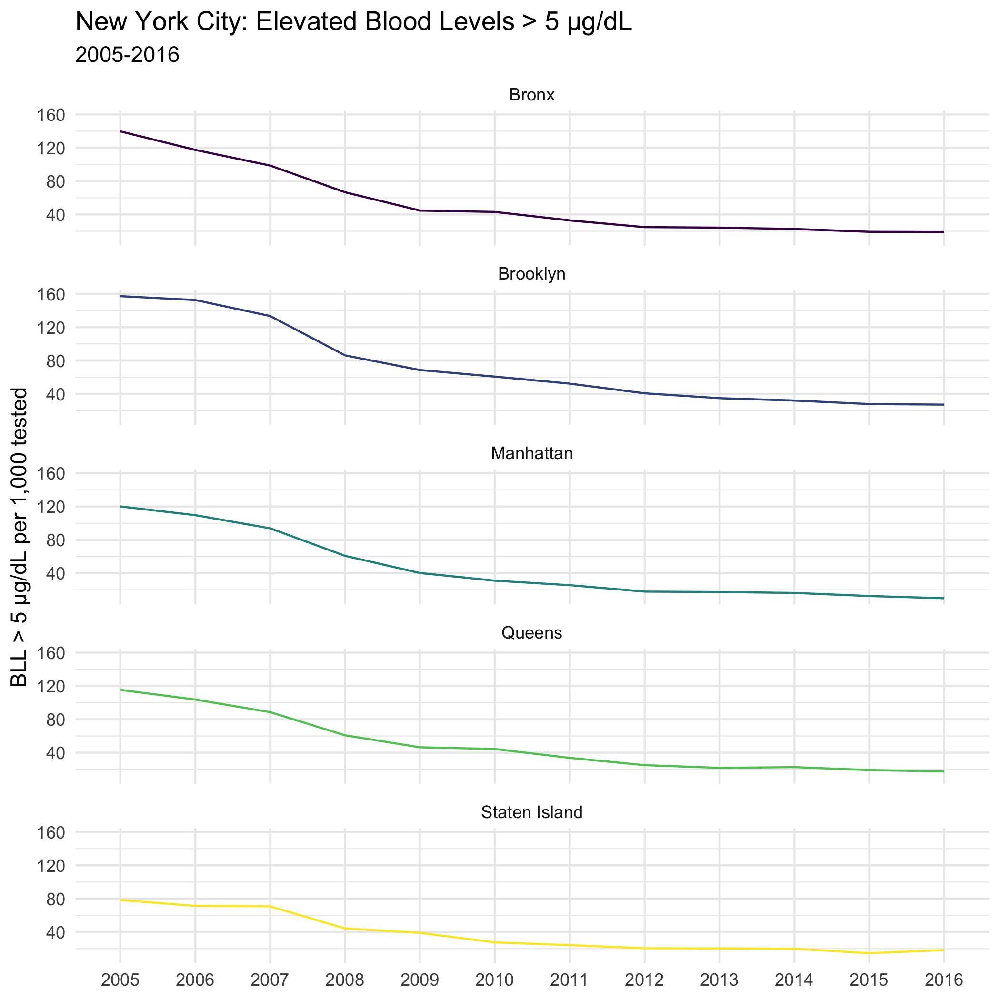

Due date: Monday, November 16th

For this problem set we will use data from [New York City](https://data.cityofnewyork.us/Health/Children-Under-6-yrs-with-Elevated-Blood-Lead-Leve/tnry-kwh5) that tested children under 6 years old for elevated blood lead levels (BLL). [You can read more about the data on their website]).

About the data:

All NYC children are required to be tested for lead poisoning at around age 1 and age 2, and to be screened for risk of lead poisoning, and tested if at risk, up until age 6. These data are an indicator of children younger that 6 years of age tested in NYC in a given year with blood lead levels of 5 mcg/dL or greater. In 2012, CDC established that a blood lead level of 5 mcg/dL is the reference level for exposure to lead in children. This level is used to identify children who have blood lead levels higher than most children's levels. The reference level is determined by measuring the NHANES blood lead distribution in US children ages 1 to 5 years, and is reviewed every 4 years.

```{r loading, include=F}
library(tidyverse)
library(kableExtra)

data <- "data/Children_Under_6_yrs_with_Elevated_Blood_Lead_Levels__BLL_.csv"
bll_nyc <- read_csv(data) %>% drop_na()
colnames(bll_nyc) <- c("borough_id", "time_period", 
                       "bll_5", "bll_10", "bll_15", "total_tested")

```

### Question 1

Recreate the below table with kable.

You will need to calculate the BLL per 1,000, filter for years 2015-2016, and rename the boroughs based on the following coding scheme:

* 1: Bronx
* 2: Brooklyn
* 3: Manhattan
* 4: Queens
* 5: Staten Island

```{r, include=F, eval=F}
knitr::include_graphics('data/question_1_table.png')
```


```{r}
bll_nyc_table <- bll_nyc %>%
  mutate(time_period = as.factor(time_period),
         borough_id = as.factor(borough_id)) %>%
  group_by(borough_id, time_period) %>%
  summarize(
    total_tested = sum(total_tested),
    bll_5 = sum(bll_5),
    bll_10 = sum(bll_10),
    bll_15 = sum(bll_15),
    bll_5_1k = round(bll_5/total_tested * 1000, 1),
    bll_10_1k = round(bll_10/total_tested * 1000, 1),
    bll_15_1k = round(bll_15/total_tested * 1000, 1)) %>%
  mutate(borough_id = factor(borough_id,
                               levels = c(1:5), 
                               labels = c("Bronx","Brooklyn",
                                             "Manhattan", "Queens", "Staten Island"),
                                          ordered=TRUE)) %>%
  filter(time_period %in% c("2015", "2016")) %>%
  select(borough_id, time_period, bll_5_1k, bll_10_1k, bll_15_1k)

kable(bll_nyc_table, 
      booktabs=T, 
      col.names=c("Borough", "Year", "BLL >5 µg/dL", "BLL >10 µg/dL", "BLL >15 µg/dL"),  
      align='lccc', 
      caption="BLL Rates per 1,000 tested in New York City, 2015-2016",
      format.args=list(big.mark=","))
```

\newpage

### Question 2

Replicate the following bar chart. Since we want the graph to have an ascending order, we will need to factor borough_id. [https://colorswall.com/palette/454/](Here are the HEX codes used for the colors):

* #ff6600: orange
* #003884: blue

```{r, include=F, eval=F}
knitr::include_graphics('data/question_2_bar.png')
```

```{r}
bll_nyc_1 <- bll_nyc %>% 
  group_by(borough_id) %>%
  summarize(bll_all = sum(bll_5, bll_10, bll_15)) 

bll_nyc_1$borough_id <- factor(bll_nyc_1$borough_id,
                               levels = c(5,3,1,4,2), #"2","3","1","4","5"
                               labels = c("Staten Island","Manhattan",
                                             "Bronx", "Queens", "Brooklyn"),
                                          ordered=TRUE)

ggplot(bll_nyc_1, aes(x = borough_id, y = bll_all)) +
  geom_col(fill = "#ff6600", color = "#003884") +
  labs(x = "boroughs",
       y = "counts of BLL > 5 µg/dL",
       title = "New York City: Elevated Blood Lead Levels 2005-2016 by Borough") +
  #scale_x_discrete(labels=c("Bronx", "Brooklyn", "Manhattan", 
                           # "Queens", "Staten Island")) +
  theme_bw()

#ggsave("data/question_2_bar.png")
```

\newpage

### Question 3

Recreate the following line graph. You will need to combine the three measures of BLL to calculate a rate per borough per year. Your data frame, at it's smallest, will have 60 observations (12 years x 5 boroughs). 

```{r, include=F, eval=F}

```

```{r}
bll_nyc_viz <- bll_nyc %>%
  mutate(time_period = as.factor(time_period),
         borough_id = as.factor(borough_id)) %>%
  group_by(borough_id, time_period) %>%
  summarize(bll = sum(bll_5, bll_10, bll_15), # get total bll
            total_tested = sum(total_tested), # sum of total tested per row
            bll_5plus_1k = round(bll/total_tested * 1000, 1)) %>%
  mutate(borough_id = factor(borough_id,
                               levels = c(1:5), 
                               labels = c("Bronx","Brooklyn", "Manhattan",
                                          "Queens", "Staten Island"),
                                          ordered=TRUE))

ggplot(bll_nyc_viz, aes(x = time_period, y = bll_5plus_1k, group = borough_id)) +
  facet_wrap(~ borough_id, ncol=1) +
  geom_line(aes(color = borough_id)) +
  theme_minimal() +
  labs(y = "BLL > 5 µg/dL per 1,000 tested",
       title = "New York City: Elevated Blood Levels > 5 µg/dL",
       subtitle = "2005-2016") +
  theme(legend.position="none", axis.title.x = element_blank())

#ggsave("data/question_3_line.png")
```

